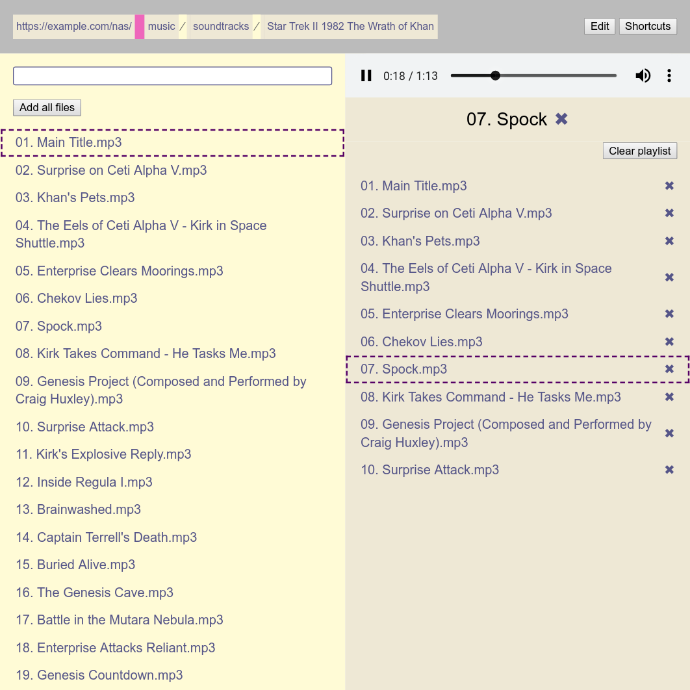

# AMP Media Player

AMP Media Player is a lightweight web-app that enables you to stream music from
[web server directory indexes](https://en.wikipedia.org/wiki/Webserver_directory_index).



AMP is the successor to
[Directory Index Media Player (DIMPL)](https://github.com/andornaut/dimpl).

## Getting Started

1.  Install `node>=10.0.0` and `npm>=6.0.0`.
1.  Run `npm install` to install project dependencies.
1.  Run `npm run server`.

## Installation

```
npm run build-production
cp -a dist /var/www/example.com/amp
```

You may need to configure your web server to
[support CORS requests](https://github.com/andornaut/http-basic-auth-proxy-worker#web-server).

## Links

- [dimpl](https://github.com/andornaut/dimpl)
- [http-basic-auth-proxy-worker](https://github.com/andornaut/http-basic-auth-proxy-worker)
- [jetstart](https://github.com/andornaut/jetstart)
