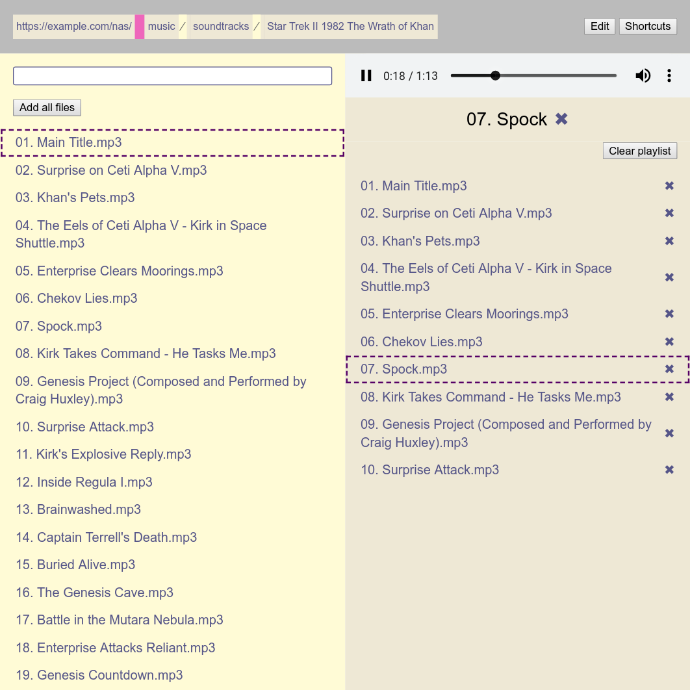

# AMP Media Player

AMP Media Player is a lightweight web-app for streaming music from
[web server directory indexes](https://en.wikipedia.org/wiki/Webserver_directory_index).



AMP is the successor to
[Directory Index Media Player (DIMPL)](https://github.com/andornaut/dimpl).

## Getting Started

1. Install the Node.js version specified in [.nvmrc](.nvmrc).
1. Run `npm install` to install project dependencies.
1. Run `npm run watch` and open http://localhost:8080.

## Development

```bash
npm run build        # Development build (with sourcemaps)
npm run build:prod   # Production build (minified, no sourcemaps)
npm run watch        # Build + dev server on :8080 with live rebuild
npm run lint         # ESLint (zero warnings tolerance)
npm run lint:fix     # ESLint with auto-fix
npm run format       # Format all source files with prettier-eslint
```

## Installation

Build and copy `dist/` to your web server:

```bash
npm run build:prod
cp -a dist /var/www/example.com/amp
```

You may need to configure your web server to
[support CORS requests](https://github.com/andornaut/http-basic-auth-proxy-worker#web-server).

## Releasing

The CI workflow automatically creates a GitHub release on every push to `main`
(tagged `main`, overwriting the previous one) and for any `v*` tag.

To cut a versioned release:

```bash
# Bump version in package.json, then:
git commit -am "chore: release vX.Y.Z"
git tag vX.Y.Z
git push && git push --tags
```

## Links

- [dimpl](https://github.com/andornaut/dimpl)
- [http-basic-auth-proxy-worker](https://github.com/andornaut/http-basic-auth-proxy-worker)
- [jetstart](https://github.com/andornaut/jetstart)
